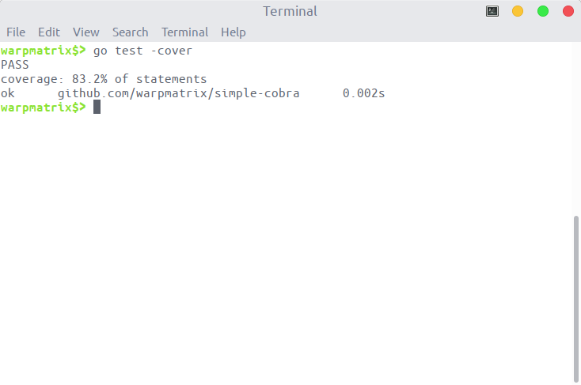
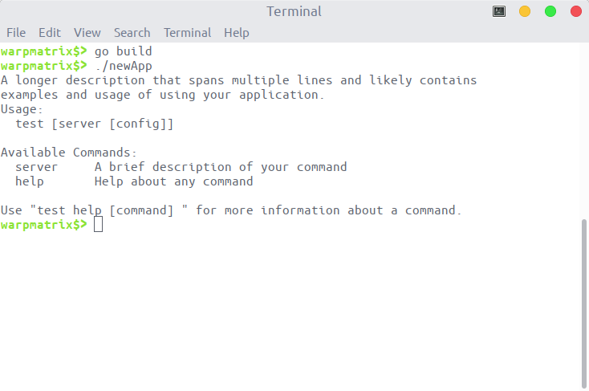
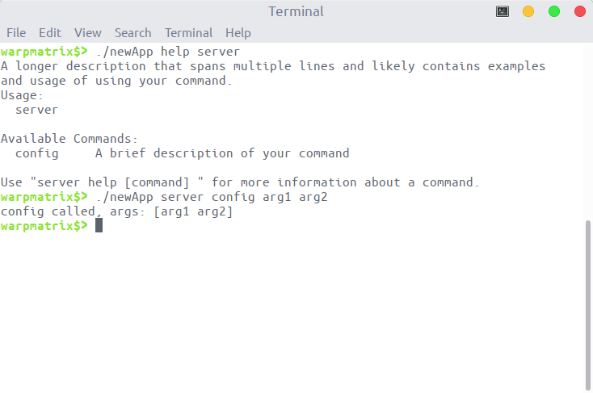

<!-- omit in toc -->
# Specification

<!-- omit in toc -->
## Table of Contents

- [1. `cobra` 的简单介绍](#1-cobra-的简单介绍)
- [2. `simple cobra` 的设计说明](#2-simple-cobra-的设计说明)
  - [2.1. `command.go` 文件](#21-commandgo-文件)
  - [2.2. `help.go` 文件](#22-helpgo-文件)
  - [2.3. `utils.go` 文件](#23-utilsgo-文件)
- [3. `simple cobra` 的单元测试](#3-simple-cobra-的单元测试)
- [4. `simple cobra` 的功能测试](#4-simple-cobra-的功能测试)
  - [4.1. 环境创建](#41-环境创建)
  - [4.2. 根指令文件](#42-根指令文件)
  - [4.3. 子指令文件](#43-子指令文件)
  - [4.4. 执行指令](#44-执行指令)

## 1. `cobra` 的简单介绍

`cobra` 可以生成一个简单的带子命令的命令行程序，使用 `go get -u github.com/spf13/cobra` 指令可以安装 `cobra` 库，安装过程可能需要手动通过 github 镜像安装对应的依赖库。使用 `go get github.com/spf13/cobra/cobra` 可以安装 `cobra` 应用程序。

完成上述两个安装步骤后，可以使用 `cobra` 指令，快速创建新的应用程序：

```bash
mkdir -p newApp && cd newApp
cobra init --pkg-name github.com/userid/newApp
```

执行初始化指令后，新的应用程序工作目录结构如下：

```plaintext
.
|---cmd
|   `root.go
`---main.go
```

在 `cmd` 文件夹中，存放了应用程序的各条子命令。可以使用 `cobra add` 指令给应用程序增加新的子命令，如执行 `cobra add config`。此时，文件结构变为：

```plaintext
.
|---cmd
|---|---config.go
|   `---root.go
`---main.go
```

此时，可以执行 `go run main.go config` 指令，得到输出的结果为：`config called`。`config` 子命令成功被加到了新的应用程序中。

## 2. `simple cobra` 的设计说明

`simple cobra` 在 `cobra` 的基础上进行了简化，去除了一些用处不大的功能，实现了最基础的用例需求——支持简单带子命令的命令行程序开发。

该包主要通过三个文件实现其功能：`command.go`、`help.go`、`utils.go`。

### 2.1. `command.go` 文件

描述该包的主要功能与逻辑。定义了 `Command` 结构体，以及 `Execute`、`Find`、`AddCommand` 等主要方法接口。

用户输入指令后，调用 `cmd.Execute()` 方法执行具体的指令：

1. 调用 `cmd.initDefaultHelpCmd()` 方法，初始化 `help` 指令
2. 调用 `cmd.Find()` 方法，解析出具体执行的指令
3. 调用 `cmd.execute()` 方法，执行具体的指令

### 2.2. `help.go` 文件

用于实现 help 指令，及定义对应 help 输出。该包提供了三种实现 help 输出的方法：

- 默认的 help 输出
- 通过用户自定义的 help 输出
- 继承父指令的 help 输出

### 2.3. `utils.go` 文件

定义实现 cobra 包所用到的一些辅助函数。如：寻找输入指令的下一个子指令、寻找指令的根指令、返回指令的名字等功能。

## 3. `simple cobra` 的单元测试

该包对每一个 go 文件编写了测试文件 `*_test.go`。以下为单元测试的结果，测试的代码覆盖率为 83.2%：



## 4. `simple cobra` 的功能测试

这里使用的功能测试的例子，为 `README.md` 中使用示例的例子。

创建一个名为 newApp 的项目。这个项目包含的命令如下：

- 根命令包含子命令 server
- server 子命令中包含 config 子命令

### 4.1. 环境创建

首先使用如下指令，创建项目环境：

```bash
mkdir newApp
cd newApp
mkdir cmd
```

接着创建对应的指令文件，并填写相应的代码，配置指令行为：

```bash
cd cmd
touch root.go server.go config.go
cd ..
```

### 4.2. 根指令文件

`root.go` 文件中记录的是应用程序根指令的信息，调用根命令的 `Execute` 方法即可执行用户输入的指令。具体代码填写的示例如下：指令填写 `Use`、`Short`、`Long` 字段用于 help 输出中。`Run` 和 `RunE` 字段表示执行指令所调用的函数，若都不填写则输出 help 的信息。

```go
package cmd

import (
    "fmt"
    "os"

    cobra "github.com/warpmatrix/simple-cobra"
)

// rootCmd represents the base command when called without any subcommands
var rootCmd = &cobra.Command{
    Use:   "test [server [config]]",
    Short: "A brief description of your application",
    Long: `A longer description that spans multiple lines and likely contains
examples and usage of using your application.`,
    // Uncomment the following line if your bare application
    // has an action associated with it:
    // Run: func(cmd *cobra.Command, args []string) { fmt.Println("main run") },
}

// Execute adds all child commands to the root command and sets flags appropriately.
// This is called by main.main(). It only needs to happen once to the rootCmd.
//
// Execute 函数执行涉及所有子命令的指令，该函数通过 main 函数只被调用一次
func Execute() {
    if err := rootCmd.Execute(); err != nil {
        fmt.Println(err)
        os.Exit(1)
    }
}
```

### 4.3. 子指令文件

为指令添加子指令，只需要增加对应的子指令文件，在 `init` 函数中调用父指令的 `AddCommand` 方法即可实现。

下面代码块中的内容为 `server.go` 文件的代码：

```go
package cmd

import (
    "fmt"

    cobra "github.com/warpmatrix/simple-cobra"
)

// serverCmd represents the server command
var serverCmd = &cobra.Command{
    Use:   "server",
    Short: "A brief description of your command",
    Long: `A longer description that spans multiple lines and likely contains examples
and usage of using your command.`,
    Run: func(cmd *cobra.Command, args []string) {
        fmt.Println("server called, args:", args)
    },
}

func init() {
    rootCmd.AddCommand(serverCmd)

    // Here you will define your flags and configuration settings.
}
```

下面的代码块中的内容为 `config.go` 文件的代码：

```go
package cmd

import (
    "fmt"

    cobra "github.com/warpmatrix/simple-cobra"
)

// configCmd represents the config command
var configCmd = &cobra.Command{
    Use:   "config",
    Short: "A brief description of your command",
    Long: `A longer description that spans multiple lines and likely contains examples
and usage of using your command.`,
    Run: func(cmd *cobra.Command, args []string) {
        fmt.Println("config called, args:", args)
    },
}

func init() {
    serverCmd.AddCommand(configCmd)

    // Here you will define your flags and configuration settings.
}
```

### 4.4. 执行指令

完成上述的所有步骤，即实现了项目的命令需求：

- 根命令包含子命令 server
- server 子命令中包含 config 子命令

我们可以编写 `main.go` 执行用户输入的指令：

```bash
touch main.go
```

给 `main.go` 文件填充以下内容：

```go
package main

// import "domain-name/your-id/your-repo/cmd"
import "github.com/warpmatrix/newApp/cmd"

func main() {
    cmd.Execute()
}
```

编译、执行的结果如下，可以看到在没有定义执行函数时，执行指令输出对应的 help 信息：

```bash
go build
./newApp
```



并且可以实现 help 输出子命令信息以及子命令的执行：

```bash
./newApp help server
./newApp server config arg1 arg2
```



可以看到上述测试的结果，满足我们对功能需求，功能测试成功完成。
